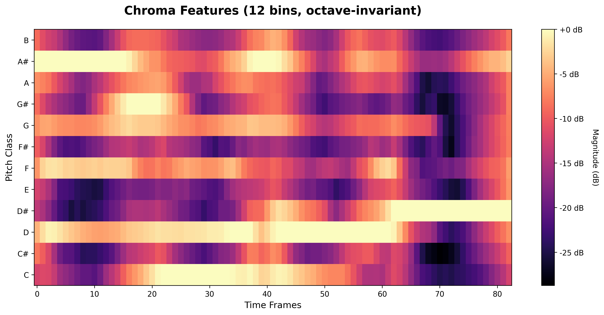
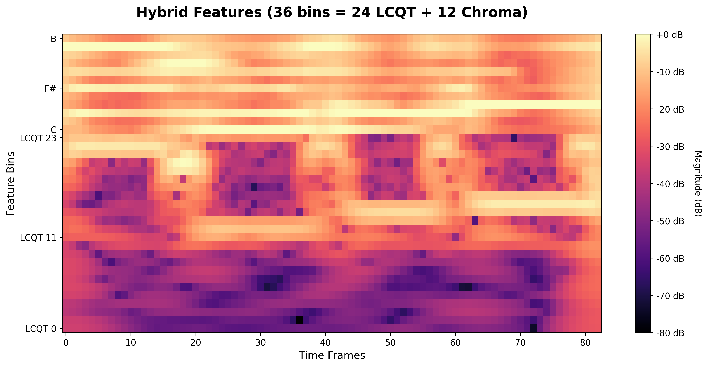
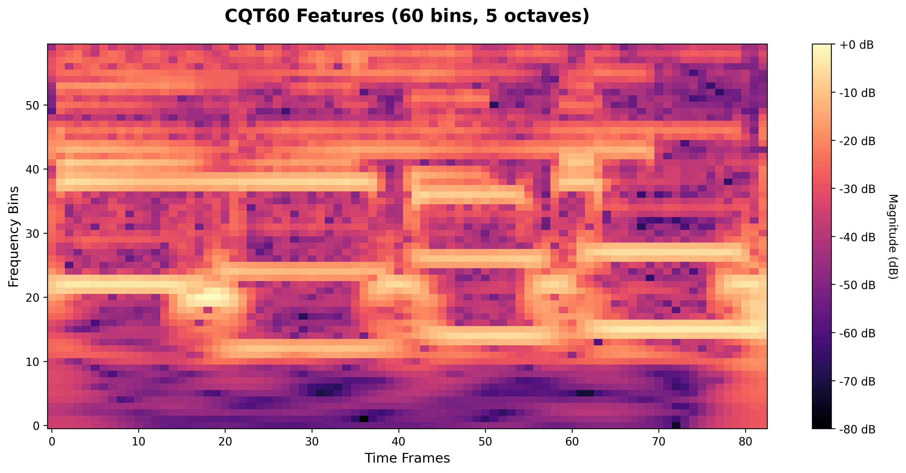
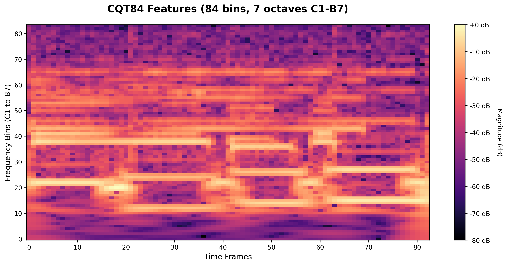

# Chord Recognition with CNNs

A deep learning project for recognizing musical chords from audio using Convolutional Neural Networks.

## Overview

This project trains CNN models to classify chords from 1-bar audio clips. Two classification tasks are supported:

1. **Root-only classification:** Predict the chord root note (12 classes: C, Db, D, Eb, E, F, Gb, G, Ab, A, Bb, B)
2. **Root + Quality classification:** Predict both root and quality (40 classes: combinations of 12 roots × chord types like maj, min, dom, etc.)

**Best performance:**
- Root-only: 80% validation accuracy (Hybrid features)
- Root + Quality: 67% validation accuracy (Chroma features)

## Quick Start

### 1. Install Dependencies

```bash
pip install -r requirements.txt
```

### 2. Prepare Data

Place audio data in `data_input/00_raw/`:

```
data_input/00_raw/song_name/
├── song_name_chords        # Text file with chord progression
└── song_name_clips/        # Bar-by-bar audio slices
    ├── Slice 1 [...].wav
    ├── Slice 2 [...].wav
    └── ...
```

**Chord file format:**
```
Fmaj7
Gbmaj7
Dm7 | Cm7    # Two chords in one bar (will be split)
Bbm7
```

### 3. Run Preprocessing

```bash
jupyter notebook data_preprocessing.ipynb
# Execute all cells
```

This outputs CSV files to `data_output/` ready for training.

### 4. Train on Kaggle

Upload the CSV files to Kaggle and train using the 'model_training.ipynb' file

## How It Works

### Audio Features

The system extracts spectral features from audio that capture harmonic and pitch information:

#### Chromagram (12 bins)


Octave-invariant pitch representation. Fast training, good for root detection.

#### Hybrid Features (36 bins)


Low-frequency CQT (24 bins) + Chromagram (12 bins). Best overall performance.

#### CQT-60 (60 bins)


Constant-Q Transform covering 5 octaves. Good balance of detail and speed.

#### CQT-84 (84 bins)


Full-range CQT spanning 7 octaves. Maximum frequency detail.

### Data Augmentation

Each sample is pitch-shifted by -2, 0, +2, +4 semitones, expanding the dataset 4x:

```
Original: song_bar01.wav → F:maj
    ↓
Augmented: song_bar01_shift-2.wav → Eb:maj
Augmented: song_bar01.wav → F:maj
Augmented: song_bar01_shift+2.wav → G:maj
Augmented: song_bar01_shift+4.wav → A:maj
```

**Important:** Use grouped train/validation splitting to prevent data leakage - all augmented versions of a bar must stay in the same split.

## Results

Performance on root note classification (12 classes):

| Feature Type | Validation Accuracy | Training Time |
|--------------|-------------------|---------------|
| Chroma | 67-68% | ~2-3 min |
| **Hybrid** | **78-80%** | ~5-6 min |
| CQT-60 | 69-70% | ~7-10 min |
| CQT-84 | 51-56% | ~8 min |

Performance on full chord classification (root + quality, 40 classes):

| Feature Type | Validation Accuracy | Training Time |
|--------------|-------------------|---------------|
| **Chroma** | **65-67%** | ~2-3 min |
| Hybrid | 56-57% | ~6-8 min |
| CQT-60 | 52-53% | ~9-12 min |
| CQT-84 | 48-50% | ~12 min |

Training performed on Kaggle GPU for 20-40 epochs with early stopping.

## Usage Example (Kaggle)

```python
import pandas as pd
import numpy as np
from sklearn.model_selection import GroupShuffleSplit

# Load data
df = pd.read_csv('../input/your-dataset/hybrid_features.csv')

# Extract features and labels
X = df.filter(regex='feature_').values
y = df['root'].map({root: i for i, root in enumerate(
    ['C', 'Db', 'D', 'Eb', 'E', 'F', 'Gb', 'G', 'Ab', 'A', 'Bb', 'B']
)}).values

# Grouped split (prevents data leakage from augmentation)
groups = df['id'].str.replace(r'_shift.*', '', regex=True)
splitter = GroupShuffleSplit(n_splits=1, test_size=0.2, random_state=42)
train_idx, val_idx = next(splitter.split(X, y, groups))

X_train, X_val = X[train_idx], X[val_idx]
y_train, y_val = y[train_idx], y[val_idx]

# Reshape for CNN (samples, channels, bins, frames)
n_bins = 36  # For hybrid features
X_train = X_train.reshape(-1, 1, n_bins, 87)
X_val = X_val.reshape(-1, 1, n_bins, 87)

# Train your model...
```

## Project Structure

```
Chord_Recognition/
├── data_preprocessing.ipynb       # Preprocessing pipeline
├── model_training.ipynb           # Training notebook
├── requirements.txt               # Dependencies
│
├── data_input/
│   └── 00_raw/                    # Input audio + chords
│
├── data_output/                   # CSV features
│   ├── chroma_features.csv
│   ├── hybrid_features.csv
│   ├── cqt60_features.csv
│   └── cqt84_features.csv
│
└── feature_visualizations/        # Example plots
```

## Requirements

- Python 3.8+
- PyTorch 2.1.0
- librosa 0.10.1
- pandas
- numpy
- soundfile
- tqdm
- jupyter

See `requirements.txt` for complete list.

## Documentation

- **CLAUDE.md** - Detailed technical documentation
- **WORKFLOW.md** - Pipeline visualization

## License

Educational project for deep learning coursework.
